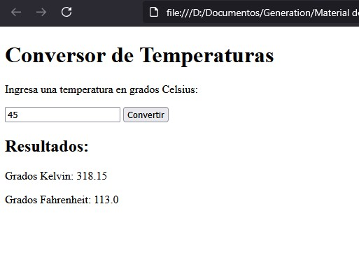

# Conversor-de-temperatura
El programa solicita al usuario una temperatura en grados Celsius, valida que la entrada sea numérica y realiza la conversión a grados Kelvin y Fahrenheit.  Los resultados se muestran tanto en el DOM como en la consola del navegador.
